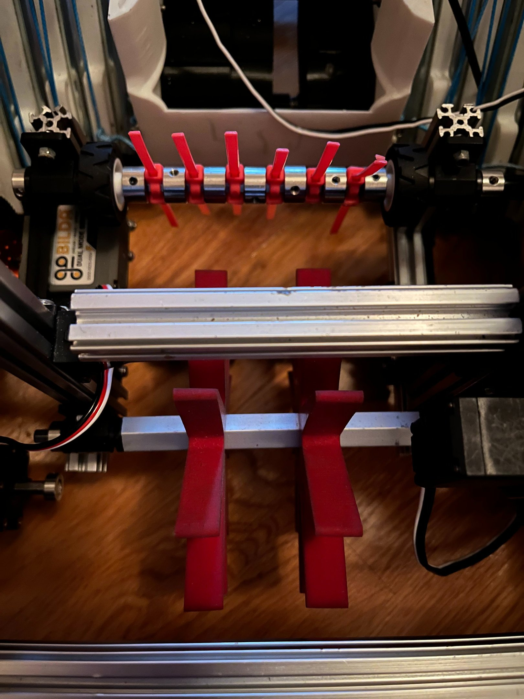
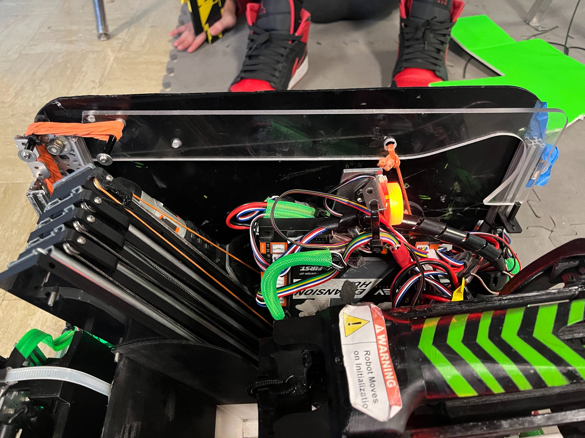

<div align="center">

# EggWUUUHH · FTC 9384 Competition Robot

### FTC Team 9384 Hydraulic Hydras · 2023–2024 CENTERSTAGE Season Robot CAD

[](https://ftc-events.firstinspires.org/team/9384)
[](#robot-and-game)
[](#cad-downloads)
[](https://grabcad.com/library/ftc-9384-2023-2024-robot-1)
[](LICENSE)

<picture>
  
</picture>

Open mechanical design solid models, competition photography, engineering documentation, and subsystem CAD for FTC Team 9384's CENTERSTAGE robot.

<strong>Quick navigation:</strong><br>
[Robot Overview](#about-the-robot) | [CAD Downloads](#cad-downloads) | [Design History](docs/DESIGN_HISTORY.md) | [Engineering Portfolio](#engineering-documentation) | [GrabCAD Model](https://grabcad.com/library/ftc-9384-2023-2024-robot-1)

</div>

---

## About the Robot

**EggWUUUHH** is the official competition machine built by FTC Team 9384 Hydraulic Hydras for the 2023–2024 **CENTERSTAGE** season. This repository preserves the complete master assembly alongside discrete subsystem models (custom plate chassis, 3-stage compliant intake, linear lift, scoring outtake, drone launcher, and winch climber).

The models were originally published on [GrabCAD by Angelo Demetroulakos](https://grabcad.com/library/ftc-9384-2023-2024-robot-1) and are mirrored locally in neutral STEP format for open accessibility without third-party account requirements.

| System Specification | Implementation Details |
| --- | --- |
| Drivetrain | 4-wheel independent Mecanum drive on custom 4-plate aluminum chassis |
| Intake mechanism | 3-stage active collection: compliant star wheels, counter-rollers, and flexible sweepers |
| Vertical lift | Multi-stage cascading linear drawer slides with 3D-printed continuous string rigging |
| Scoring outtake | Dual-pixel articulated box with mechanical retention pincher and backdrop landing skids |
| Aerial drone launcher | Spring-tensioned sled with dual servo release and angle elevation control |
| Rigging & climber | High-speed motorized winch pulling side-mounted pivoting stage truss hooks |

## Robot and Game

During CENTERSTAGE matches, robots collected hexagonal plastic pixels and placed them on an angled 60° backdrop to create continuous mosaic scoring patterns. Endgame opportunities rewarded suspending the entire robot chassis from the central stage truss and launching a paper drone into designated zones.

<div align="center">

| Master Robot Front 3/4 View | Rear Subsystem & Wiring View |
| :---: | :---: |
|  |  |

</div>

<div align="center">

| Active 3-Stage Intake Iteration | Side-Mounted High-Speed Winch Climber |
| :---: | :---: |
|  |  |

</div>

Read the full technical design evolution across all 4 competition iterations in [`docs/DESIGN_HISTORY.md`](docs/DESIGN_HISTORY.md).

## CAD Downloads

All solid models are exported in neutral ISO 10303 STEP format compatible with Fusion 360, Onshape, SolidWorks, Autodesk Inventor, and FreeCAD:

| Subsystem Model | Description & Hierarchy | Direct Download |
| --- | --- | :---: |
| `Main v18.step` | Complete master competition robot assembly | [Download STEP](CAD/Main%20v18.step?raw=1) |
| `Final Chassis V130.step` | Four-plate aluminum chassis frame and drivetrain | [Download STEP](CAD/Final%20Chassis%20V130.step?raw=1) |
| `Chassis and Climber.step` | Integrated chassis with side-mounted winch hooks | [Download STEP](CAD/Chassis%20and%20Climber.step?raw=1) |
| `Intake.step` | 3-stage active compliant roller intake assembly | [Download STEP](CAD/Intake.step?raw=1) |
| `Lift and Outtake.step` | Cascading slide rigging and dual-pixel delivery box | [Download STEP](CAD/Lift%20and%20Outtake.step?raw=1) |
| `Logitech920Mount_v4.step` | Custom angled Logitech C920 USB camera bracket | [Download STEP](CAD/Logitech920Mount_v4.step?raw=1) |

## Engineering Documentation

The team's complete judged documentation submitted at the NYC Championship:

| Document | Technical Scope | Direct Link |
| --- | --- | :---: |
| **Engineering Portfolio** | 15-page concise executive judging document | [Open Portfolio PDF](Portfolio%26Notebook/9384%202024%20Portfolio%20FINAL.pdf) |
| **Engineering Notebook** | Comprehensive season-long day-by-day technical log | [Open Notebook PDF](Portfolio%26Notebook/9384%20Notebook%202024%20FINAL.pdf) |

## Integrity Verification

SHA-256 integrity checksums for all distributed STEP files, PDFs, and high-resolution media are maintained in [`CHECKSUMS.sha256`](CHECKSUMS.sha256).

## License & Attribution

Original models, renders, photography, and documentation are licensed under the **[Creative Commons Attribution 4.0 International License](LICENSE)**.

```text
Based on the FTC 9384 2023–2024 Robot by Angelo Demetroulakos and FTC Team 9384 Hydraulic Hydras,
licensed under CC BY 4.0. Source: https://github.com/AloeVeraZ/FTC9384-2024-Robot
```

---

<div align="center">

Built by **FTC Team 9384 · Hydraulic Hydras**

</div>
